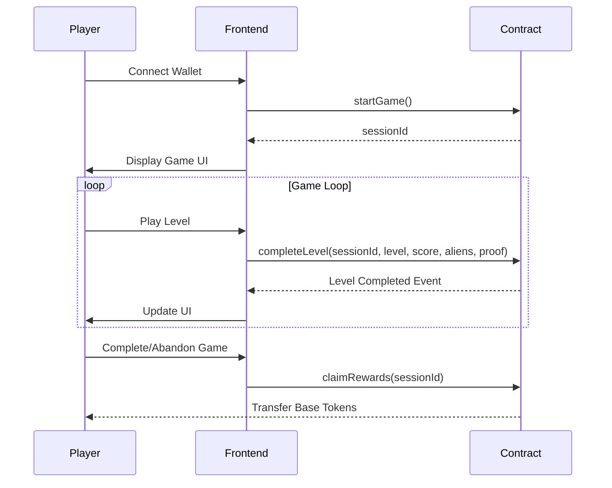

# Architecture Documentation

This document describes the high-level architecture, system design, and key technical decisions for the SpaceBase project.

## 🏗️ System Overview

SpaceBase is a play-to-earn Space Invaders game built on the Base network. The system consists of smart contracts for game logic and reward distribution, with a web frontend for user interaction.

```
┌─────────────────┐    ┌─────────────────┐    ┌─────────────────┐
│   Web Frontend  │    │  Smart Contract │    │   Base Network  │
│   (Next.js)     │◄──►│ (SpaceInvaders) │◄──►│   (L2 Ethereum) │
│                 │    │                 │    │                 │
│ • Game UI       │    │ • Game Logic    │    │ • Secure        │
│ • Wallet Conn.  │    │ • Reward System │    │ • Fast TXs      │
│ • State Mgmt    │    │ • Session Mgmt  │    │ • Low Fees      │
└─────────────────┘    └─────────────────┘    └─────────────────┘
```

## 🧩 Core Components

### Smart Contract Layer

#### SpaceInvadersGame Contract

**Location**: `contract/src/SpaceInvadersGame.sol`

**Purpose**: Main game contract handling all gameplay mechanics, reward distribution, and session management.

**Key Features**:

- Game session lifecycle management
- Level progression and validation
- Reward calculation and distribution
- Anti-cheat mechanisms
- Emergency controls (pause/unpause)

**Security Features**:

- Reentrancy protection via OpenZeppelin's `ReentrancyGuard`
- Access control via OpenZeppelin's `Ownable`
- Emergency pause functionality via `Pausable`
- Level completion verification to prevent cheating

### Frontend Layer

#### Next.js Application

**Location**: `frontend/`

**Purpose**: Web interface for players to interact with the game.

**Planned Components**:

- Game canvas and UI components
- Wallet connection (RainbowKit)
- Game state management
- Real-time game updates

## 🔄 Data Flow

### Game Session Flow



### Reward Distribution Flow

1. **Contract Funding**: Owner funds contract with Base tokens
2. **Level Completion**: Player earns rewards per completed level
3. **Reward Claiming**: Player claims accumulated rewards
4. **Transfer**: Contract transfers Base tokens to player

## 📊 Data Structures

### GameSession Struct

```solidity
struct GameSession {
    uint256 sessionId;
    address player;
    uint256 currentLevel;
    uint256 levelsCompleted;
    uint256 totalRewardsEarned;
    uint256 startTime;
    uint256 levelStartTime;
    bool isActive;
    bool isCompleted;
    uint256[] levelHashes; // Anti-cheat verification
}
```

### Key Mappings

- `gameSessions`: Session ID → GameSession
- `playerSessions`: Player address → Array of session IDs
- `playerTotalRewards`: Player address → Total lifetime rewards
- `levelHashUsed`: Level hash → Boolean (prevents replay attacks)

## 🎯 Game Mechanics

### Level Progression

- **Total Levels**: 5
- **Level Duration**: 60 seconds each
- **Alien Count**: Increases by 11 per level (11, 22, 33, 44, 55)
- **Reward per Level**: 0.0006667 ETH (~$2 worth of Base)

### Session States

- **Active**: Game in progress, player can complete levels
- **Completed**: All 5 levels finished successfully
- **Abandoned**: Player quit before completion (keeps partial rewards)

### Anti-Cheat Mechanisms

1. **Level Time Limits**: 60 seconds per level
2. **Alien Verification**: Must destroy exact number of aliens for level
3. **Hash Prevention**: Each level completion creates unique hash
4. **Session Ownership**: Only session creator can modify

## 🔐 Security Considerations

### Smart Contract Security

- **Reentrancy Protection**: All state-changing functions use `nonReentrant`
- **Access Control**: Owner-only functions for admin operations
- **Input Validation**: All parameters validated before processing
- **Emergency Pause**: Contract can be paused in case of issues
- **Balance Checks**: Contract balance verified before reward transfers

### Economic Security

- **Sufficient Funds**: Contract must have enough Base for rewards
- **Partial Rewards**: Players keep earnings for completed levels even if they quit
- **No Double Claims**: Rewards reset to zero after claiming

## 🚀 Deployment Architecture

### Network: Base Mainnet

- **Chain ID**: 8453
- **RPC URL**: https://mainnet.base.org
- **Block Time**: ~2 seconds
- **Gas Token**: ETH (but rewards in Base-wrapped ETH)

### Contract Deployment

- **Verification**: Contract verified on BaseScan
- **Immutability**: No upgrade mechanism (by design)
- **Funding**: Owner can fund contract post-deployment

## 📈 Scalability Considerations

### Current Limitations

- **Single Contract**: All game logic in one contract
- **Storage Growth**: Player sessions stored permanently
- **Gas Costs**: Complex operations may be expensive

### Future Improvements

- **Contract Upgrades**: Consider proxy pattern for future upgrades
- **Data Archiving**: Move old sessions to cheaper storage
- **Gas Optimization**: Further optimize contract functions

## 🔗 Integration Points

### Wallet Integration

- **RainbowKit**: For wallet connection
- **Farcaster MiniApp**: Planned social features
- **Base Network**: Native Base token rewards

### Frontend Integration

- **Web3.js/Ethers**: Contract interaction
- **Contract ABI**: Generated from Solidity compilation
- **Event Listening**: Real-time game state updates

## 🧪 Testing Strategy

### Unit Tests

- **Contract Functions**: All public functions tested
- **Edge Cases**: Invalid inputs, time limits, balance checks
- **Security**: Reentrancy, access control, overflow protection

### Integration Tests

- **Full Game Flow**: Start → Complete Levels → Claim Rewards
- **Frontend Contract**: Interaction between UI and contract
- **Network Conditions**: Test on Base testnet

## 📋 Development Workflow

### Contract Development

1. **Local Testing**: `forge test`
2. **Formatting**: `forge fmt`
3. **Gas Analysis**: `forge snapshot`
4. **Deployment**: Script-based deployment with verification

### Frontend Development

1. **Component Development**: Isolated UI components
2. **Contract Integration**: Web3 interaction hooks
3. **Testing**: Unit and integration tests
4. **Deployment**: Vercel/Netlify hosting

## 🎯 Key Design Decisions

### Why Base Network?

- **Low Fees**: Cost-effective for frequent game interactions
- **Fast Transactions**: ~2 second block times for responsive gameplay
- **Ethereum Compatibility**: Access to broader DeFi ecosystem

### Why No Staking Required?

- **Accessibility**: Lower barrier to entry for new players
- **Simplicity**: Focus on gameplay rather than token management
- **Viral Potential**: Easier to share and try the game

### Why Fixed Rewards?

- **Predictability**: Players know exact rewards upfront
- **Simplicity**: No complex reward calculations
- **Trust**: Transparent reward structure

### Why 5 Levels?

- **Engagement**: Short enough to complete, long enough to be challenging
- **Reward Balance**: Sufficient rewards to be meaningful
- **Technical Limits**: Gas costs and complexity considerations

## 🔮 Future Architecture

### Planned Enhancements

- **Multi-Contract Architecture**: Separate contracts for different features
- **ZK-Proofs**: Advanced anti-cheat mechanisms
- **Cross-Chain**: Support for multiple networks
- **NFT Integration**: In-game assets and achievements
- **Tournament System**: Competitive gameplay modes

This architecture provides a solid foundation for the SpaceBase game while allowing for future expansion and improvements.
