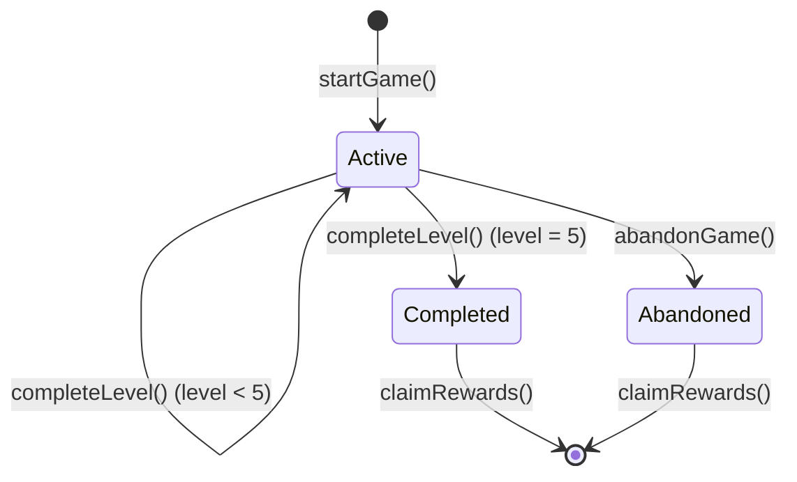

# Smart Contract API Reference

This document provides comprehensive documentation for the SpaceInvadersGame smart contract, including all public functions, events, and data structures.

## 📋 Contract Overview

- **Contract Address**: `0xEa0f94BD92DbcE3D340E660311aA1cF9Aacbe11a`
- **Network**: Base Mainnet (Chain ID: 8453)
- **Language**: Solidity ^0.8.19
- **Framework**: Foundry

## 🎮 Core Functions

### Game Management

#### `startGame() → uint256`

Starts a new game session for the caller.

**Parameters**: None

**Returns**:

- `sessionId`: Unique identifier for the game session

**Requirements**:

- Contract must not be paused
- Caller must not have an active session (enforced by game logic)

**Events Emitted**:

- `GameStarted(sessionId, player, startTime)`

**Example**:

```solidity
uint256 sessionId = spaceInvaders.startGame();
```

---

#### `completeLevel(uint256 sessionId, uint256 level, uint256 score, uint256 aliensDestroyed, bytes proof)`

Completes a level and awards rewards.

**Parameters**:

- `sessionId`: The game session identifier
- `level`: Level number being completed (1-5)
- `score`: Player's score for the level
- `aliensDestroyed`: Number of aliens destroyed
- `proof`: Verification proof (currently simplified)

**Requirements**:

- Contract not paused
- Valid session ID
- Caller is session owner
- Session is active
- Level matches current level
- Level completed within time limit (60 seconds)
- Correct number of aliens destroyed for level

**Events Emitted**:

- `LevelCompleted(sessionId, player, level, levelHash)`

**Errors**:

- `InvalidLevel`: Level doesn't match current level
- `LevelTimeExpired`: Level not completed in time
- `InvalidLevelHash`: Incorrect alien count
- `LevelHashAlreadyUsed`: Replay attack detected

**Example**:

```solidity
// Complete level 1 with 11 aliens destroyed
spaceInvaders.completeLevel(sessionId, 1, 1000, 11, "");
```

---

#### `abandonGame(uint256 sessionId)`

Abandons the current game session and claims partial rewards.

**Parameters**:

- `sessionId`: The game session to abandon

**Requirements**:

- Contract not paused
- Valid session ID
- Caller is session owner
- Session is active

**Behavior**:

- Marks session as inactive
- Preserves rewards for completed levels
- Player keeps earned rewards

**Events Emitted**:

- `GameAbandoned(sessionId, player, levelsCompleted, partialRewards)`

**Example**:

```solidity
spaceInvaders.abandonGame(sessionId);
```

---

#### `claimRewards(uint256 sessionId)`

Claims all earned rewards for a completed game session.

**Parameters**:

- `sessionId`: The game session identifier

**Requirements**:

- Contract not paused
- Valid session ID
- Caller is session owner
- Session is not active (game completed or abandoned)
- Player has completed at least one level
- Contract has sufficient balance

**Behavior**:

- Transfers Base tokens to player
- Resets session rewards to prevent double claiming

**Events Emitted**:

- `RewardsClaimed(sessionId, player, amount)`

**Errors**:

- `NoRewardsToClaim`: No levels completed
- `InsufficientContractBalance`: Contract doesn't have enough funds

**Example**:

```solidity
spaceInvaders.claimRewards(sessionId);
```

## 📊 View Functions

#### `getSessionInfo(uint256 sessionId) → (address, uint256, uint256, uint256, uint256, bool, bool)`

Returns detailed information about a game session.

**Parameters**:

- `sessionId`: The session identifier

**Returns**:

- `player`: Player's address
- `currentLevel`: Current level (1-5)
- `levelsCompleted`: Number of completed levels
- `totalRewardsEarned`: Total rewards earned (in wei)
- `startTime`: Session start timestamp
- `isActive`: Whether session is active
- `isCompleted`: Whether game is fully completed

**Requirements**:

- Valid session ID

**Example**:

```solidity
(
    address player,
    uint256 currentLevel,
    uint256 levelsCompleted,
    uint256 rewards,
    uint256 startTime,
    bool isActive,
    bool isCompleted
) = spaceInvaders.getSessionInfo(sessionId);
```

---

#### `getPlayerSessions(address player) → uint256[]`

Returns all session IDs for a player.

**Parameters**:

- `player`: Player's address

**Returns**:

- Array of session IDs

**Example**:

```solidity
uint256[] memory sessions = spaceInvaders.getPlayerSessions(playerAddress);
```

---

#### `getLevelTimeRemaining(uint256 sessionId) → uint256`

Returns remaining time for current level in seconds.

**Parameters**:

- `sessionId`: The session identifier

**Returns**:

- Remaining time in seconds (0 if expired or inactive)

**Requirements**:

- Valid session ID

**Example**:

```solidity
uint256 timeLeft = spaceInvaders.getLevelTimeRemaining(sessionId);
if (timeLeft == 0) {
    // Level time expired
}
```

---

#### `getContractBalance() → uint256`

Returns the contract's Base balance.

**Returns**:

- Contract balance in wei

**Example**:

```solidity
uint256 balance = spaceInvaders.getContractBalance();
```

---

#### `getPlayerTotalRewards(address player) → uint256`

Returns total lifetime rewards earned by a player.

**Parameters**:

- `player`: Player's address

**Returns**:

- Total rewards earned across all sessions (in wei)

**Example**:

```solidity
uint256 totalEarned = spaceInvaders.getPlayerTotalRewards(playerAddress);
```

---

#### `getAlienCountForLevel(uint256 level) → uint256`

Returns the number of aliens for a given level.

**Parameters**:

- `level`: Level number (1-5)

**Returns**:

- Number of aliens (level \* 11, max 55)

**Example**:

```solidity
uint256 aliens = spaceInvaders.getAlienCountForLevel(3); // Returns 33
```

## 👑 Owner Functions

#### `pause()`

Pauses the contract (emergency stop).

**Requirements**:

- Caller must be contract owner

**Events Emitted**:

- `Paused(account)` (from Pausable)

**Example**:

```solidity
spaceInvaders.pause();
```

---

#### `unpause()`

Unpauses the contract.

**Requirements**:

- Caller must be contract owner

**Events Emitted**:

- `Unpaused(account)` (from Pausable)

**Example**:

```solidity
spaceInvaders.unpause();
```

---

#### `withdraw(uint256 amount)`

Withdraws Base tokens from the contract.

**Parameters**:

- `amount`: Amount to withdraw in wei

**Requirements**:

- Caller must be contract owner
- Contract must have sufficient balance

**Events Emitted**:

- `OwnerWithdraw(owner, amount)`

**Example**:

```solidity
spaceInvaders.withdraw(1 ether);
```

---

#### `fundContract() payable`

Funds the contract with Base tokens for rewards.

**Parameters**:

- `msg.value`: Amount of Base to send

**Requirements**:

- Must send some value
- Called by owner (but anyone can fund via receive function)

**Events Emitted**:

- `ContractFunded(funder, amount)`

**Example**:

```solidity
spaceInvaders.fundContract{value: 10 ether}();
```

## 📢 Events

### Game Events

#### `GameStarted(uint256 indexed sessionId, address indexed player, uint256 startTime)`

Emitted when a new game session starts.

#### `LevelCompleted(uint256 indexed sessionId, address indexed player, uint256 level, bytes32 levelHash)`

Emitted when a level is completed.

#### `GameCompleted(uint256 indexed sessionId, address indexed player, uint256 totalRewards)`

Emitted when all 5 levels are completed.

#### `RewardsClaimed(uint256 indexed sessionId, address indexed player, uint256 amount)`

Emitted when rewards are claimed.

#### `GameAbandoned(uint256 indexed sessionId, address indexed player, uint256 levelsCompleted, uint256 partialRewards)`

Emitted when a game is abandoned.

### Administrative Events

#### `OwnerWithdraw(address indexed owner, uint256 amount)`

Emitted when owner withdraws funds.

#### `ContractFunded(address indexed funder, uint256 amount)`

Emitted when contract receives funding.

## ⚙️ Constants

- `REWARD_PER_LEVEL`: `0.0006667 ether` (~$2 worth of Base)
- `MAX_LEVELS`: `5`
- `LEVEL_DURATION`: `60 seconds`
- `ALIENS_PER_ROW`: `11`

## 🔒 Modifiers

- `onlyValidSession(uint256 sessionId)`: Validates session exists
- `onlySessionOwner(uint256 sessionId)`: Validates caller owns session
- `onlyActiveSession(uint256 sessionId)`: Validates session is active
- `whenNotPaused`: From Pausable (contract not paused)
- `nonReentrant`: From ReentrancyGuard (prevents reentrancy)
- `onlyOwner`: From Ownable (owner-only functions)

## 🚨 Error Types

- `NoActiveSession`: Invalid session access
- `SessionNotActive`: Session not active
- `InvalidLevel`: Level validation failed
- `LevelAlreadyCompleted`: Level already done
- `LevelTimeExpired`: Level timeout
- `InvalidLevelHash`: Verification failed
- `LevelHashAlreadyUsed`: Replay attack
- `NoRewardsToClaim`: No rewards available
- `InsufficientContractBalance`: Contract underfunded
- `TransferFailed`: Token transfer failed
- `InvalidSession`: Session doesn't exist

## 💰 Gas Costs (Estimated)

| Function           | Gas Cost | Notes                 |
| ------------------ | -------- | --------------------- |
| `startGame()`      | ~80,000  | Creates new session   |
| `completeLevel()`  | ~120,000 | Includes verification |
| `abandonGame()`    | ~50,000  | Simple state change   |
| `claimRewards()`   | ~30,000  | Native transfer       |
| `getSessionInfo()` | ~5,000   | View function         |

_Note: Gas costs vary based on network conditions and EVM optimizations._

## 🔗 Integration Examples

### Starting a Game

```javascript
// Using ethers.js
const contract = new ethers.Contract(address, abi, signer);
const tx = await contract.startGame();
const receipt = await tx.wait();
const sessionId = receipt.events[0].args.sessionId;
```

### Monitoring Game State

```javascript
// Listen for level completion
contract.on("LevelCompleted", (sessionId, player, level, levelHash) => {
  console.log(`Level ${level} completed by ${player}`);
  updateGameUI(sessionId, level);
});
```

### Checking Time Remaining

```javascript
const timeLeft = await contract.getLevelTimeRemaining(sessionId);
if (timeLeft < 10) {
  showWarning("Hurry! Less than 10 seconds left!");
}
```

## 🛡️ Security Considerations

- All state-changing functions are protected against reentrancy
- Level completion requires exact alien count verification
- Hash-based replay attack prevention
- Owner functions restricted to contract owner
- Emergency pause functionality available
- Input validation on all parameters

## 🔄 State Transitions



This API reference provides everything needed to integrate with the SpaceInvadersGame contract. For implementation examples, see the [examples documentation](../examples/).
